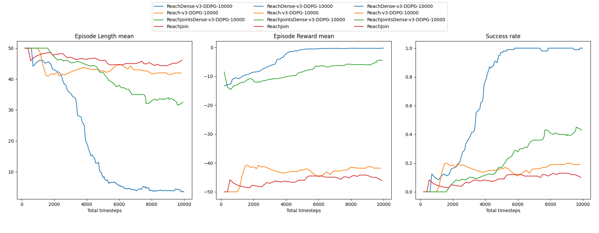

## THU SIGS RL Spring 2024, Final Project Group 2

### Installation:

Install packages `stable-baselines 3`  (sb3) and `gymnasium`, and `pandagym` according to their docs. (Also install `seaborn` package if you want to run the plot script)

Can be installed into a python environment like conda.

### Run Experiment

After installing (and activating conda environment, if any), run a script with `python3 panda_gym_test_agent.py`.

### Alternative options

Run in Google Colab (install sb3, gymnasium, panda and copy code to there) if it is not working on OS besides Ubuntu.

### Available scripts:

- `pandagym_train_sb3.py` - to train RL agent in pandagym environment, can be visualized and saved

- `plot_panda_gym_results.py` - to plot results after training, if agent was saved

- `pandagym_test_agent.py` - to test your saved RL agent in pandagym env.

- `pandagym_train_demo.py` - no use, just minimal demo code for presenting training agent in gym

- `gym_classiccontrol_sb3.py` - to just try out gymnasium and sb3 libraries.

### Possible open tasks and questions:

- [] Can we solve reach, pick-and-place, etc. tasks with DDPG if we train more than 10.000 timesteps?

- [] Can we solve reach, pick-and-place, etc. tasks with any other algorithm if DDPG doesnt work?

- [] Can we improve the training somehow? (Pretrain agent with demonstrations/Imitation Learning)

*Previously from midterm presentation slide*

1. Consider RL setting：
Which algorithm for which task manipulation problem will work the best? 
Can we converge with baseline algorithms for the most realistic configuration?

2. Consider Training result:
Is the resulting behaviour the agent learned efficient? 
Is the motion maybe jerky, not fluent, or uncanny overall? 

3. Consider Experiment tricks:
Can we mitigate issues in 1. and 2. with improvements common for RL in robotics, such as Behaviour Cloning, Curriculum Learning, Reward Shaping, or hybrid architectures with model-based controllers?

### Results from Midterm experiment 

(agents right-winch, muted-radio, dynamic-denim, odious-redoubt in pandatrain_logs)

